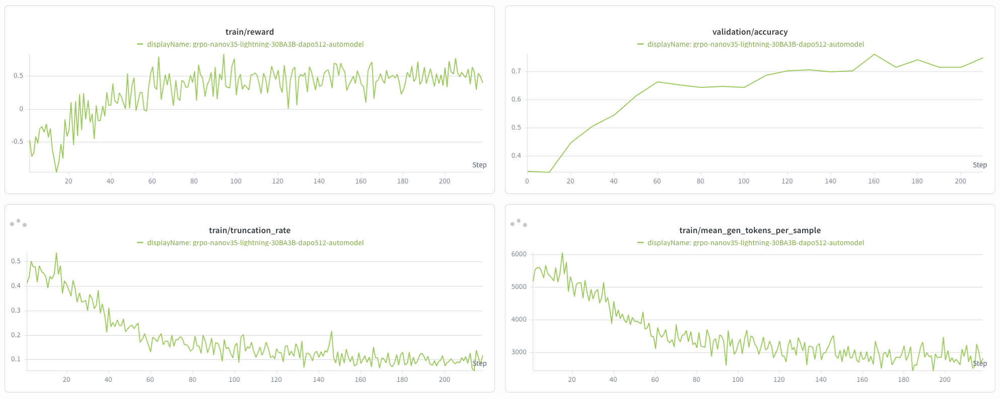

# Nemotron 3.5 Lightning

> **Note:** This document has moved and will be deprecated here. See the new location: https://github.com/NVIDIA-NeMo/RL/blob/main/docs/guides/models/nemotron/nemotron-3.5-lightning.md

This guide covers two ways to post-train Nemotron 3.5 Lightning with NeMo RL:

- [RLVR with NeMo Gym (GB200 reference run)](#rlvr-with-nemo-gym-gb200-reference-run) —
  the full 86-node asynchronous GRPO + NeMo Gym recipe used for the reference
  RLVR stage on GB200 NVL72 (ARM64 / aarch64) hardware.
- [DAPO math RL with the automodel backend](#dapo-math-rl-with-the-automodel-backend) —
  a compact 4-node DAPO recipe on the DTensor (automodel) training backend,
  useful as a smaller-footprint starting point on x86 H100 clusters.

## RLVR with NeMo Gym (GB200 reference run)

This section explains how to reproduce the Nemotron 3.5 Lightning RLVR recipe
with NeMo RL on **GB200 NVL72** (ARM64 / aarch64) hardware.

### Overview

Nemotron 3.5 Lightning is post-trained in a single Reinforcement Learning with
Verifiable Rewards (RLVR) stage using asynchronous Group Relative Policy
Optimization (GRPO) and NeMo Gym.

Training and policy generation use separate node pools. The GenRM and
general-purpose NL2Bash judge run as external vLLM pools in the same Slurm
heterogeneous allocation, while the smaller content-safety judge runs in the
Gym pool.

The recipe files are under
`examples/nemo_gym/nemotron-3.5-lightning/`:

- `rlvr.yaml` contains the training, generation, reward, and Gym configuration.
- `lightning35_launch.sh` handles Slurm submission, code snapshots, persistent
  caches, container mounts, and run-specific paths.

The reference run uses the following training configuration:

| Setting | Value |
|---|---:|
| Maximum sequence length | 73,728 tokens |
| Prompts per step | 512 |
| Generations per prompt | 16 |
| Global batch size | 8,192 |
| Training parallelism | TP=4, CP=4, EP=16, PP=1 |
| Policy-generation parallelism | TP=4, PP=1 |
| Training precision | BF16 |

#### Topology

The recipe uses four GPUs per GB200 node:

| Component | Deployment | Nodes | GPUs |
|---|---|---:|---:|
| Training | Megatron TP=4, CP=4, EP=16 | 32 | 128 |
| Policy generation | NeMo RL vLLM TP=4 | 32 | 128 |
| Safety judge | Gym vLLM TP=4, DP=2 | 2 | 8 |
| GenRM | 8 independent TP=8 vLLM servers | 16 | 64 |
| NL2Bash judge | 4 independent TP=4 vLLM servers | 4 | 16 |
| **Total** |  | **86** | **344** |

### Prepare the code

Clone NeMo RL and its submodules on a filesystem visible to every allocated
node:

```bash
git clone --recursive https://github.com/NVIDIA-NeMo/RL.git
cd RL
```

The launcher mounts the current NeMo RL source, Lightning recipe directory,
and Gym checkout into the training container. With `USE_SNAPSHOT=1` (the
default), it first snapshots tracked source files so the submitted job uses a
stable copy.

### Container

Nemotron 3.5 Lightning uses vLLM and requires an **aarch64 (arm64)** image for
GB200 NVL72 nodes. Prebake the NeMo Gym virtual environments used by the recipe
to avoid building them every time a training job starts. From the root of the
NeMo RL repository, build and push the image:

```bash
docker buildx build \
  --platform linux/arm64 \
  --progress=plain \
  -f docker/Dockerfile \
  --target release \
  -t <your-registry>/nemo-rl:main-lightning35-prefetched-venvs \
  --push \
  --build-context nemo-rl=. \
  --build-arg MAX_JOBS=8 \
  --build-arg SKIP_SGLANG_BUILD=1 \
  --build-arg SKIP_TRTLLM_BUILD=1 \
  --build-arg NEMO_GYM_PREFETCH_CONFIGS="examples/nemo_gym/nemotron-3.5-lightning/rlvr.yaml" \
  .
```

Build arguments:

- `NEMO_GYM_PREFETCH_CONFIGS` builds the Gym virtual environments referenced
  by `rlvr.yaml` into the image.
- `SKIP_SGLANG_BUILD=1` skips SGLang because this recipe uses vLLM.
- `SKIP_TRTLLM_BUILD=1` skips TensorRT-LLM because this recipe does not use it.
- `MAX_JOBS` controls parallel build jobs; tune it for the build machine.
- `--build-context nemo-rl=.` builds from the current checkout. Without it,
  the Dockerfile pulls `NVIDIA-NeMo/RL.git#main`.

On a Slurm cluster using [enroot](https://github.com/NVIDIA/enroot), convert
the image to squashfs:

```bash
enroot import -o nemo-rl-lightning35.sqsh \
  docker://<your-registry>/nemo-rl:main-lightning35-prefetched-venvs
```

Pass the resulting `.sqsh` path as `CONTAINER`. A registry image URI can be
used instead on clusters that do not require a local squashfs image. The same
image is used for training, policy generation, and the external judge pools by
default.

### Download and prepare the data

The RLVR blend is published as
[`nvidia/Nemotron-RL-Lightning-Training-Blend`](https://huggingface.co/datasets/nvidia/Nemotron-RL-Lightning-Training-Blend).
It contains `rlvr.jsonl` and `fill_placeholders.py`. Math rows originating from
`BytedTsinghua-SIA/DAPO-Math-17k` and `Skywork/Skywork-OR1-RL-Data` are
represented by placeholders; the bundled script restores them from the
original datasets on Hugging Face. This is the same general preparation flow
used by the [Nemotron 3 Ultra recipe](nemotron-3-ultra.md#download-and-prepare-the-data).

```bash
export DATA_DIR=/path/to/lightning/data

# Download rlvr.jsonl and fill_placeholders.py.
uvx --from huggingface-hub hf download \
  nvidia/Nemotron-RL-Lightning-Training-Blend \
  --repo-type dataset \
  --local-dir lightning-blend

# Restore the source-backed placeholders into $DATA_DIR/rlvr.jsonl.
chmod +x lightning-blend/fill_placeholders.py
./lightning-blend/fill_placeholders.py \
  --input-dir lightning-blend \
  --output-dir "$DATA_DIR"
```

The resulting `$DATA_DIR/rlvr.jsonl` is already in the format expected by
`NemoGymDataset`. The released recipe does not run periodic, start, or end
validation, but the launcher still requires both paths. To reproduce the
reference run, pass the restored blend as both:

```bash
TRAIN_PATH=$DATA_DIR/rlvr.jsonl
VAL_PATH=$DATA_DIR/rlvr.jsonl
```

Rows select their Gym agent through `agent_ref`. The corresponding agent and
resource-server configs are already listed under `env.nemo_gym.config_paths`
in `rlvr.yaml`.

For each external dataset you elect to use, you are responsible for confirming
that its license is appropriate for your intended use.

### Build the sandbox container

Several Gym environments used by the Lightning blend, including `ns_tools`
and `math_formal_lean`, execute verification tools in a sandbox container.
Build it from the
[NeMo Skills Dockerfile](https://github.com/NVIDIA-NeMo/Skills/blob/main/dockerfiles/Dockerfile.sandbox):

```bash
git clone https://github.com/NVIDIA-NeMo/Skills.git
cd Skills
git checkout b620e79
docker build -t nemo-skills-sandbox:latest -f dockerfiles/Dockerfile.sandbox .
```

For Slurm clusters using enroot, convert it to a `.sqsh`:

```bash
enroot import -o nemo-skills-sandbox.sqsh \
  dockerd://nemo-skills-sandbox:latest
```

Pass this image as `SANDBOX_CONTAINER` when launching training.

### Prepare the policy and judge models

Set `MODEL_PATH` to the Transformers-compatible Nemotron 3.5 Lightning SFT
checkpoint from which RLVR should start.

```bash
MODEL_PATH=/path/to/nemotron-3.5-lightning-sft-checkpoint
```

The recipe uses three judge roles:

| Variable | Reference model | Deployment |
|---|---|---|
| `GENRM_MODEL` | [`nvidia/NVIDIA-Nemotron-3-Ultra-550B-A55B-GenRM`](https://huggingface.co/nvidia/NVIDIA-Nemotron-3-Ultra-550B-A55B-GenRM) | 8 external TP=8 servers |
| `NL2BASH_JUDGE_MODEL` | [`Qwen/Qwen3-235B-A22B-Instruct-2507-FP8`](https://huggingface.co/Qwen/Qwen3-235B-A22B-Instruct-2507-FP8) | 4 external TP=4 servers |
| `SAFETY_JUDGE_MODEL` | [`nvidia/Nemotron-Content-Safety-Reasoning-4B`](https://huggingface.co/nvidia/Nemotron-Content-Safety-Reasoning-4B) | Gym TP=4, DP=2 |

### Launch script

Run `examples/nemo_gym/nemotron-3.5-lightning/lightning35_launch.sh` from the
repository root. The launcher handles Slurm submission, source snapshots,
persistent compile caches, container mounts, external vLLM services, and
run-specific paths. Training hyperparameters and parallelism remain in
`rlvr.yaml` and the launcher defaults.

Optional knobs:

| Variable | Default | Purpose |
|---|---|---|
| `WALLTIME` | `4:00:00` | Slurm `--time` |
| `NUM_TRAIN_NODES`, `NUM_GEN_NODES`, `NUM_GYM_NODES` | `32`, `32`, `2` | Training, policy-generation, and in-cluster Gym node counts |
| `NRL_MAX_STEPS` | _from YAML_ | Override `grpo.max_num_steps` |
| `WANDB_PROJ` | `nemotron-3.5-lightning` | W&B project name |
| `DRY_RUN` | `0` | Set to `1` to print the resolved training command without submitting |

### Launch RLVR

The following command launches the complete 86-node reference topology. Run it
from a NeMo RL checkout located under the shared filesystem root:

```bash
export SHARED_ROOT=/shared
export DATA_DIR=$SHARED_ROOT/data/lightning

EXP_NAME=lightning35-rlvr \
MODEL_PATH=$SHARED_ROOT/models/nemotron-3.5-lightning-sft-checkpoint \
TRAIN_PATH=$DATA_DIR/rlvr.jsonl \
VAL_PATH=$DATA_DIR/rlvr.jsonl \
GENRM_MODEL=nvidia/NVIDIA-Nemotron-3-Ultra-550B-A55B-GenRM \
NL2BASH_JUDGE_MODEL=Qwen/Qwen3-235B-A22B-Instruct-2507-FP8 \
SAFETY_JUDGE_MODEL=nvidia/Nemotron-Content-Safety-Reasoning-4B \
CONTAINER=$SHARED_ROOT/containers/nemo-rl-lightning35.sqsh \
SANDBOX_CONTAINER=$SHARED_ROOT/containers/nemo-skills-sandbox.sqsh \
PERSISTENT_CACHE=$SHARED_ROOT/cache/lightning35-rlvr \
HF_HOME=$SHARED_ROOT/cache/huggingface \
HF_TOKEN=$HF_TOKEN \
RESULTS_DIR=$SHARED_ROOT/results/lightning35-rlvr \
EXTERNAL_VLLM_SHARED_ROOT=$SHARED_ROOT \
EXTRA_MOUNTS=$SHARED_ROOT:$SHARED_ROOT \
SLURM_PARTITION=your-partition \
SLURM_ACCOUNT=your-account \
bash examples/nemo_gym/nemotron-3.5-lightning/lightning35_launch.sh
```

## DAPO math RL with the automodel backend

The recipe `examples/configs/recipes/llm/dapo-nanov3.5-30BA3B-4n8g-automodel.yaml`
trains [`nvidia/NVIDIA-Nemotron-3.5-Lightning-30B-A3B-BF16`](https://huggingface.co/nvidia/NVIDIA-Nemotron-3.5-Lightning-30B-A3B-BF16)
with DAPO on math data using the DTensor (automodel) training backend and
colocated vLLM generation. It runs on 4 nodes of 8x H100 80GB and is also
exercised as a nightly test
(`tests/test_suites/llm/dapo-nanov3.5-30BA3B-4n8g-automodel.sh`).

### Overview

| Setting | Value |
|---|---:|
| Algorithm | GRPO with DAPO (dynamic sampling, overlong filtering, reward scaling/shaping, TIS) |
| Data | `DAPOMath17K` train / `DAPOMathAIME2024` validation |
| Maximum sequence length | 9,216 tokens (8,192 generated) |
| Rollouts per step | 32 prompts x 16 generations (global batch size 512) |
| Training parallelism | DTensor FSDP with EP=8, TP=1, activation checkpointing |
| Policy generation | Colocated vLLM TP=4 |
| Optimizer | TransformerEngine `FusedAdam`, lr 1e-6, wd 0.1, 10-step warmup |
| Training precision | BF16 |

The Lightning checkpoint ships a Multi-Token Prediction (MTP) module
(`mtp.*` weights, `num_nextn_predict_layers=1`). The recipe ignores MTP
end-to-end without code changes: the automodel custom NemotronH
implementation builds only the backbone and LM head, the DCP loader never
reads the `mtp.*` tensors, and vLLM skips them at load and refit. Keep
`dtensor_cfg.automodel_kwargs.force_hf` and generation `speculative_config`
unset, otherwise the MTP module is instantiated.

### Launch training

From the repository root:

```bash
uv run examples/run_grpo.py \
    --config examples/configs/recipes/llm/dapo-nanov3.5-30BA3B-4n8g-automodel.yaml \
    logger.wandb_enabled=True
```

For launching on a multi-node Slurm or Kubernetes cluster, see the
[cluster guide](../cluster.md). Interrupted runs resume automatically
from the latest checkpoint in `checkpointing.checkpoint_dir`.

### Results

Over roughly 210 steps, training reward climbs
from -0.7 to about 0.5 and AIME-2024 validation accuracy improves from 0.33
to about 0.75. The truncation rate drops from ~0.5 to ~0.1 as responses
shorten from ~5,500 to ~3,000 generated tokens per sample.


